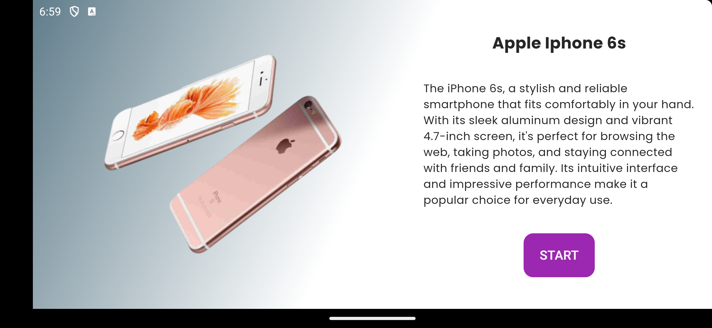
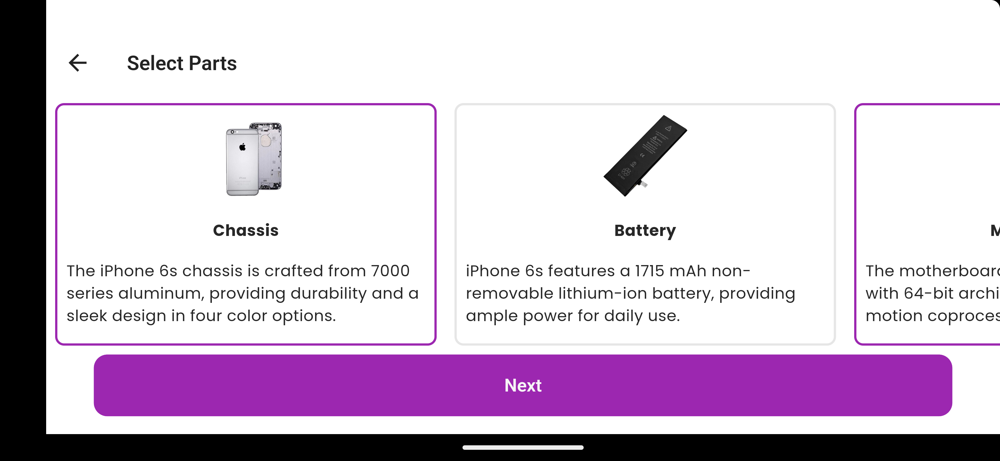
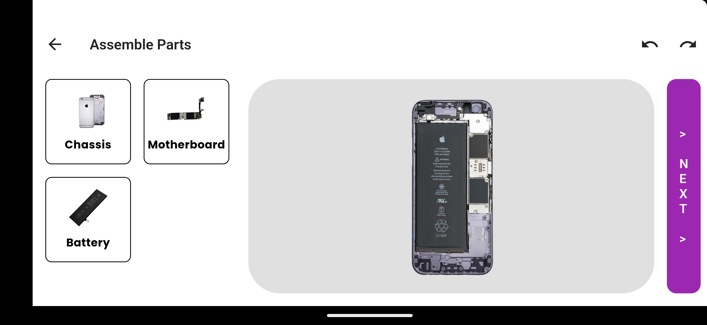
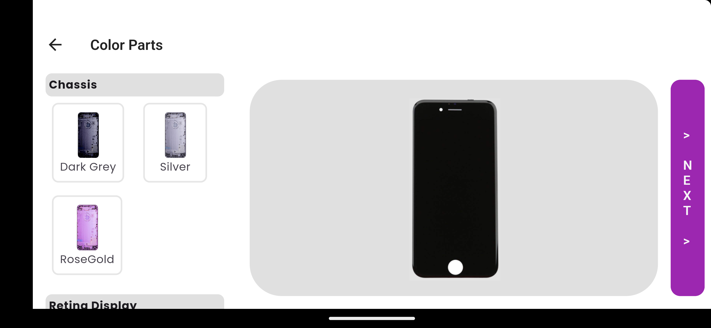
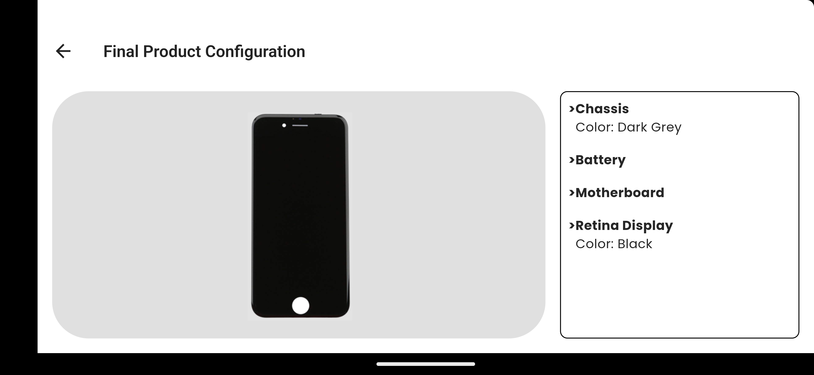

# Product Configurator App

A Product Configurator Flutter App devoloped for Evobi Automations.

## Table of Contents

- [Introduction](#introduction)
- [Objective](#objective)
- [Notes](#notes)
- [Download](#download)
- [Installation](#installation)
- [App Screenshots](#app-screenshots)


## Introduction

This App is Iphone 6s Phone Assembler part by part Configurator devoloped using flutter.

## Objective

1. Think of any product - which can be broken into min 5 different main parts. Ex: cycle: has parts - wheel, frame, seat, handle, mudguard, side stand. Suggest you use a different product for your app, minimum 5 parts should be there.(selected product is Iphone 6s)
2. 1st screen: A Textual product description page showing the whole product image & a "START" button. on the click of start - 2nd screen is shown
3. 2nd screen: all parts are given as a scrollable (horizontal scroll) list on the screen with part images & names below the image in the form of a card view. Here parts can be selected for assembling. This screen is like a shopping cart. Preferred, whatever has been selected, be highlighted as selected or there is a check box for it. NOTE: The user can select all or only 3 parts out of the maximum number of parts listed there.
4. 3rd screen: A Drag-N-Drop method to assemble the parts as images at the center of the screen to form the product. The selected parts from the 2nd screen can be kept on the left side of the screen as part images, inside a panel as a vertically scrollable view. NOTE: It is not necessary for the user to complete the entire product. Example: in cycle case, the user can only fit the wheel, frame & seat, the rest they'll not assemble. the application should still accept partial assembly
5. 4th screen: the assembled parts done by the user, should come as is on this screen. Here the user should be able to add a colour on to the parts ( on each parts) separately. you can either give a colour pallet or give min 4 colour options to choose from by selecting the part & then applying the colour. The colour should be applicable separately to each of the parts.
6. 5th Screen: The final product view - which the user has assembled at the 3rd screen & the colour applied at the 4th screen.

## Notes

> [!NOTE]
> Selected Product is iPhone 6s
> - Has a maximum of 7 parts (must select at least 3 parts)
> - Has parts with color variation:
>   - Chassis [3]
>   - Display [2]


## Download

You can download the latest version of the APK from the [Releases](https://github.com/jyothishram/evobi_product_configurator/releases) page.


## Installation

> [!TIP]
>After Installing Flutter
> - Clone this repository

```
cd product_configurator
flutter run
```

## App Screenshots

>1.Start Screen:



>2.Parts Selection Screen:



>3.Parts Assembly Screen:



>4.Parts Color Selection Screen:



>5.Final Product Screen:


